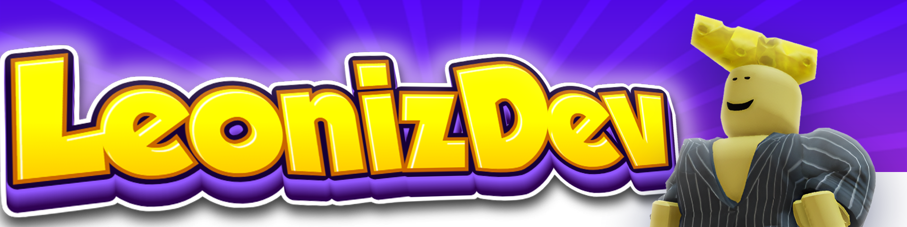

# Hello, I'm LeonizDev!

## Roblox game Developer | Lua programmer | Project Manager

## 🛒 My Services

- 💬 **Development Consultation** — [Learn More](https://www.fiverr.com/leonid_filin/create-the-game-you-need-in-roblox-development-in-roblox-studio)
- ⚒️ **Roblox scripting** — [Learn More](https://www.fiverr.com/leonid_filin/create-the-game-you-need-in-roblox-development-in-roblox-studio)
- 🚀 **Game Pass/ Developer product creation** — [Learn More]()

## **_🎯 I strive to combine technical knowledge with creativity so that your game brings a unique experience and fun to thousands of users around the world!_**

---

## 📊 My Skills

 

---

## 📫 Contact Me

-  **[Email](mailto:leonizdev@mail.ru)** — My Email
-  **[Fiverr](https://www.fiverr.com/leonid_filin)** — My services
-  **[TikTok](https://www.tiktok.com/@leonizzzdev)** — My TikTok

<!--## ⚒️ My Projects

<table>
  <tr>
    <td>
      
      
Houses buying system 🏠

    </td>
    <td>
      
      
Проект 2

    </td>
    <td>
      
      
Проект 3

    </td>
  </tr>
</table>

---

## Детали проекта

### House buying system 🏠 

Описание проекта 1. Здесь вы можете рассказать о том, как создавался проект, какие технологии использовались и какие были сложности.

---

### Проект 2 

Описание проекта 2. Пояснения, функционал и особенности разработки.

---

### Проект 3 

Описание проекта 3. Информация о том, что было сделано и какие инструменты использовались.

[Видео проекта 3](https://www.youtube.com/watch?v=dQw4w9WgXcQ) --!>>
